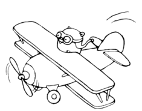

# go-circleImage

Create round images in go. Based on this article: https://blog.golang.org/go-imagedraw-package

Image source: https://golang.org/doc/gopher/biplane.jpg by Renee French, Creative Commons 3.0 Attributions license